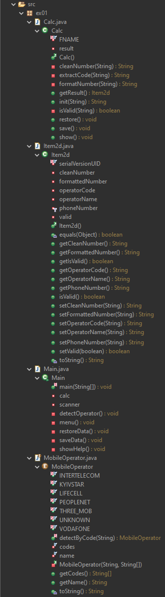

# Консольна програма з виводом на екран аргументів командної строки

## Завдання для викнання

1. Підготувати сховище до розміщення проекту
2. Написати просту консольну програму (наприклад вивід на екран аргументів командної строки)
3. Прикріпити посилання на GIT та архівований проект

## Хід роботи

### Структура програми

```
    ├── src
    │   ├── main
    │   │   └── Main.java
    │   └── test
    │       └── Test.java
    ├── .gitignore
    ├── LICENSE
    └── README.md
```

### Приклад роботи програми

Через виклик Test.java

```
    === Запуск тесту програми ===

    Тест 1: Запуск без аргументів
    Програма запущена!
    Отримано аргументів: 0
    Аргументи командного рядка відсутні.

    Тест 2: Запуск з одним аргументом
    Програма запущена!
    Отримано аргументів: 1
    Список аргументів:
    1: String [0]

    Тест 3: Запуск з декількома аргументами
    Програма запущена!
    Отримано аргументів: 4
    Список аргументів:
    1: String [0]
    2: String [1]
    3: String [2]
    4: String [3]

    Тест 4: Передача аргументів з командного рядка Test
    Програма запущена!
    Отримано аргументів: 0
    Аргументи командного рядка відсутні.

    === Тестування завершено ===
```
Через командну строку (для цього потрбіно ввести в командний рядок "java main.Main arg1 arg2 arg3")
```
    Програма запущена!
    Отримано аргументів: 3
    Список аргументів:
    1: arg1
    2: arg2
    3: arg3
```


### Принцип роботи

Програма складається з двох класів, які працюють разом:

    1. Main.java - основна логіка програми
        - Показує повідомлення про запуск
        - Повідомляє скільки аргументів отримано
        - Якщо аргументів немає → виводить "Аргументи відсутні"
        - Якщо аргументи є → виводить їх список з нумерацією
    
    2. Test.java - тестування програми з різними аргументами
        - Створюється масив аргументів для кожного тесту
        - Викликається метод Main.main() з цим масивом
        - Управління передається в клас Main
        - Main обробляє аргументи і виводить результат
        - Повертаємось в Test для наступного тесту

### Фото програми


