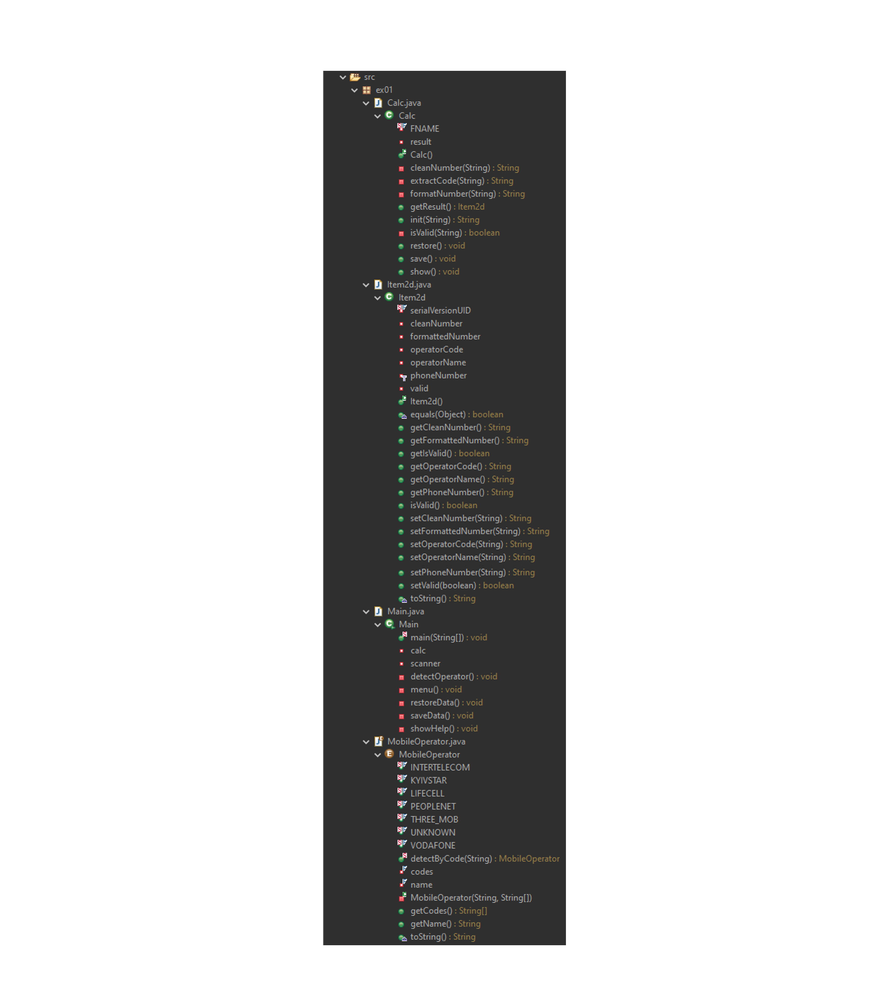

# Завдання 2 - Класи та об'єкти  (03.03.26р)

## Загальне завдання 
  Розробити клас, що серіалізується, для зберігання параметрів і результатів обчислень.
  Використовуючи агрегування, розробити клас для знаходження рішення задачі.
  Розробити клас для демонстрації в діалоговому режимі збереження та відновлення стану об'єкта, використовуючи серіалізацію. Показати особливості використання transient полів.
  Розробити клас для тестування коректності результатів обчислень та серіалізації/десеріалізації.
  Використовувати докладні коментарі для автоматичної генерації документації засобами javadoc.
## Індивідуальне завдання
  19. Визначити мобільного оператора за заданим номером абонента.

## Структура проекту:

<table>
  <tr>
    <td></td>
    <td></td>
  </tr>
  <tr>
    <td>Підпис до фото 1 (необов'язково)</td>
    <td>Підпис до фото 2 (необов'язково)</td>
  </tr>
</table>
